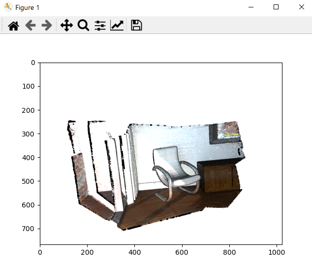

# render_depthmap_example

This is an example of the Open3D PR:
https://github.com/intel-isl/Open3D/pull/2564

For pyvista (VTK), check `pyvista` branch
https://github.com/pablospe/render_depthmap_example/tree/pyvista

## How to run the example?

    # creat environment
    conda env create -f environment_open3d.yml
    conda activate open3d

    # install package (check platform)
    pip install open3d-0.11.1-cp38-cp38-win_amd64.whl      (in windows)
    pip install open3d-0.11.1-cp38-cp38-linux_x86_64.whl   (in linux)

    # run example
    python main.py

#### Capture the screen

#### Capture depth

